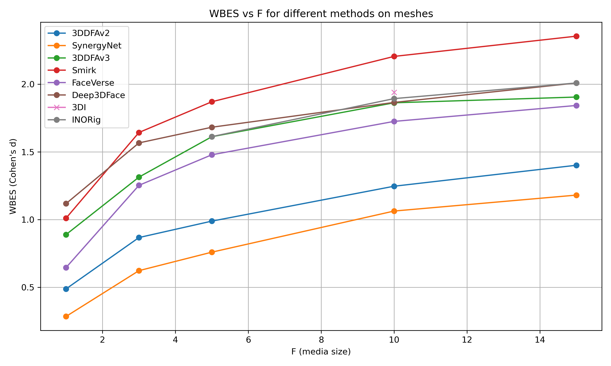
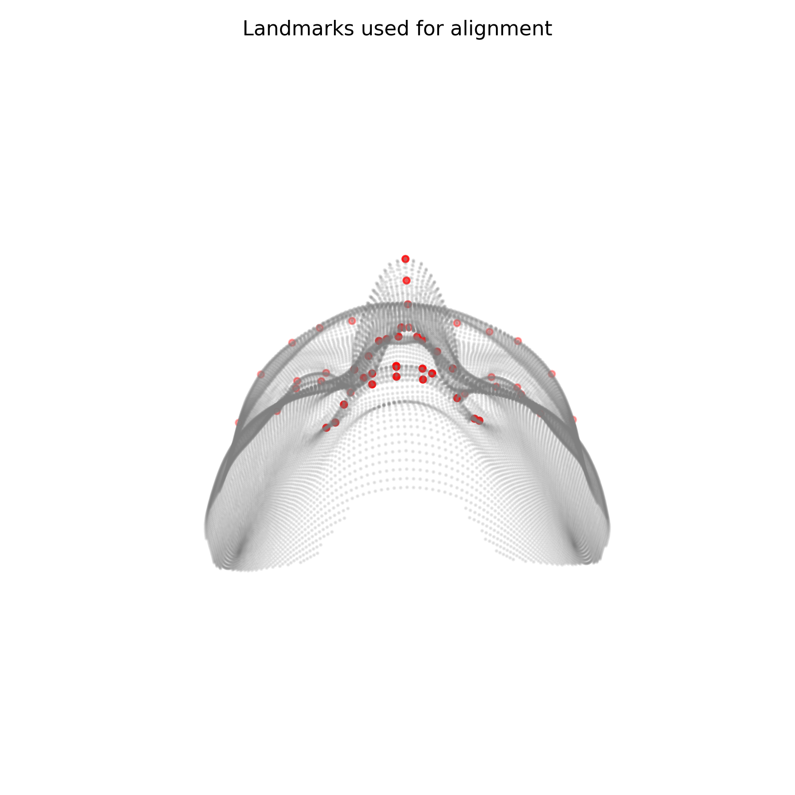

# WBES Face Embedding

<p align="center">
  
  
  
  
  
  
</p>

<p align="center">
  Official research repository for the NeurIPS 2026 submission on identity-sensitive 3D face embeddings under topology changes.
</p>

<p align="center">
  
</p>

## Overview

This repository is mainly about one problem:

> How do we learn 3D face embeddings that preserve identity, not just geometry, and keep working when mesh topology changes?

This is the official repository for the NeurIPS 2026 submission. The current top model for the submission lives at:

```text
face_embedding/gt_encdec/remeshing/intrinsic/newdata/dn_mixed_topology_v1
```

The primary checkpoint/config pair is:

```text
face_embedding/gt_encdec/remeshing/intrinsic/newdata/dn_mixed_topology_v1/
└── mixed_xtopo_rank0p5_id0p25_bs5_best/
    ├── checkpoints/best_by_xtopo_mesh_clean.pth
    └── config.json
```

The codebase tackles that problem in five connected layers:

- `face_embedding`: the main modeling branch, with DiffusionNet-based encoders, autoencoders, latent analysis, and spectral variants.
- `face_embedding/.../remeshing/intrinsic/robustness`: the strongest robustness branch, where embeddings are stress-tested under remeshing, perturbations, and topology shifts.
- `faceBench/latentVSpipeline`: the paper-facing latent-vs-geometry comparison pipeline built on FaceBench stages such as raw Chamfer, rigid ICP, and NICP.
- `datasets/FaceVerse`: FaceVerse processing, 10k remeshing, cross-topology evaluation, sigma sweeps, and few-shot fine-tuning experiments.
- `WBES`: the evaluation branch that measures whether identity separability is actually preserved.

The repository also contains GT-ready alignment, remeshing utilities, operator precomputation, and a vendored `BFM_to_FLAME` conversion utility.

## If You Only Read One Part

The technical center of gravity is:

- [`face_embedding/gt_encdec/autoencoder/dataset_gtready.py`](face_embedding/gt_encdec/autoencoder/dataset_gtready.py)
- [`face_embedding/gt_encdec/autoencoder/diffusion_autoencoder.py`](face_embedding/gt_encdec/autoencoder/diffusion_autoencoder.py)
- [`face_embedding/gt_encdec/remeshing/intrinsic/robustness/train_runner.py`](face_embedding/gt_encdec/remeshing/intrinsic/robustness/train_runner.py)
- [`face_embedding/gt_encdec/remeshing/intrinsic/newdata/dn_mixed_topology_v1/`](face_embedding/gt_encdec/remeshing/intrinsic/newdata/dn_mixed_topology_v1)
- [`faceBench/latentVSpipeline/run_facebench_remesh.py`](faceBench/latentVSpipeline/run_facebench_remesh.py)
- [`datasets/FaceVerse/compare_model_vs_chamfer_rankings_faceverse.py`](datasets/FaceVerse/compare_model_vs_chamfer_rankings_faceverse.py)

That is where the repo stops being "metrics around 3D faces" and becomes a real mesh-embedding research codebase.

## Visual Snapshot

<table>
  <tr>
    <td align="center">
      
      <br>
      <sub>WBES trends as more frames are averaged</sub>
    </td>
    <td align="center">
      
      <br>
      <sub>Landmark-based topology alignment support</sub>
    </td>
  </tr>
</table>

## What Is In This Repo

### 1. Face embedding: the core modeling branch

This is where most of the modeling work lives.

It includes:

- baseline DiffusionNet autoencoders
- encoder-only identity embeddings
- intrinsic descriptor variants based on HKS/WKS
- spectrum-aware encoders
- latent extraction and ranking analysis
- reusable model definitions shared across multiple experiments

Main area:

- [`face_embedding/gt_encdec/`](face_embedding/gt_encdec)
- current top run:
  - [`face_embedding/gt_encdec/remeshing/intrinsic/newdata/dn_mixed_topology_v1/mixed_xtopo_rank0p5_id0p25_bs5_best/`](face_embedding/gt_encdec/remeshing/intrinsic/newdata/dn_mixed_topology_v1/mixed_xtopo_rank0p5_id0p25_bs5_best)

### 2. Topology robustness: where the embedding story gets interesting

The repository does not only ask whether embeddings work on clean canonical meshes.
It asks whether identity structure survives:

- remeshing
- decimation
- cropping
- noisy perturbations
- topology changes

This is the role of the REMESH generation scripts and the `intrinsic/robustness` package.

The most structured current path is:

- [`face_embedding/gt_encdec/remeshing/intrinsic/robustness/`](face_embedding/gt_encdec/remeshing/intrinsic/robustness/)

The strongest saved branch for the paper currently uses six REMESH topology labels:

- `original`
- `remesh`
- `crop`
- `noisy`
- `down8k`
- `up60k`

The operator-enriched REMESH directory currently contains all six variants for 500 subjects.

### 3. FaceBench latent-vs-geometry pipeline

This branch is the paper-facing comparison against transparent geometry pipelines:

- [`faceBench/latentVSpipeline/`](faceBench/latentVSpipeline/)

It compares learned latent rankings against:

- raw symmetric Chamfer
- rigid ICP + point-to-point distance
- NICP / registered correspondence variants
- distance-compression analyses and figure generation

The current aggregated FaceBench comparison in `outputs/baseline_dn_mixed_topology_v1` shows the learned latent ranking beating every collected geometry metric row in that table. For example, mean latent Spearman is about `0.73`, compared with about `0.34` for raw Chamfer, `0.29` for rigid Chamfer, `0.19` for NICP correspondence, and `0.01` for rigid+CPD Chamfer.

### 4. FaceVerse validation and fine-tuning

FaceVerse is now a substantial validation branch, not just a small utility folder:

- [`datasets/FaceVerse/`](datasets/FaceVerse/)

It contains scripts and artifacts for:

- downsampling FaceVerse meshes to about 10k vertices
- generating remesh-10k topology alternatives
- precomputing DiffusionNet operators
- assembling original/remesh cross-topology datasets via symlinks
- comparing model rankings against FaceVerse GT distance matrices
- running post-perturbation ICP baselines and sigma sweeps
- few-shot FaceVerse fine-tuning under cross-topology splits

The current base FaceVerse full-neutral evaluation is useful as an external stress test: the top REMESH-trained model keeps a meaningful latent ranking on clean FaceVerse (`Spearman ~= 0.53`), but Chamfer remains stronger on that within-topology FaceVerse setting. The few-shot FaceVerse fine-tuning branch improves the cross-topology held-out signal substantially in the stored 75-shot mixed-augmentation runs.

### 5. WBES: identity-aware evaluation

WBES stands for Within- and Between-subject Effect Size.

Its role here is important, but secondary to the embedding code: it is the branch that checks whether identity separability is really there.

The idea is:

- low within-subject variability is good
- high between-subject variability is good
- the larger the gap, the better identity is preserved

This branch contains:

- mesh-level WBES
- landmark-level WBES
- geometry-vs-identity correlation analyses
- plotting utilities for result interpretation

Main area:

- [`WBES/`](WBES)

## Why This Repo Is Interesting

Many 3D face pipelines optimize geometry first and treat identity as a side effect.
This repository flips that perspective and puts the embedding question first.

It is built around the idea that:

- the interesting part is not only reconstructing a face mesh,
- it is learning a representation that keeps subject identity,
- and then testing whether that representation survives topology variation instead of overfitting a single clean mesh layout.

That makes the project relevant if you work on:

- 3D face reconstruction
- 3D face embedding / retrieval
- identity-preserving generation
- geometric deep learning
- spectral mesh learning
- robust representation learning

## Repository Map

```text
WBES-FaceEmbedding/
├── faceBench/
│   └── latentVSpipeline/     # FaceBench latent-vs-geometry comparison for the paper
├── face_embedding/
│   └── gt_encdec/
│       ├── alignment/        # GT-ready mesh preparation
│       ├── autoencoder/      # core model zoo + latent analysis
│       ├── mse/              # pairwise geometric baselines
│       └── remeshing/        # robustness, intrinsic, cross-topology work
│           └── intrinsic/
│               └── newdata/
│                   └── dn_mixed_topology_v1/ # current top submission model
├── datasets/
│   ├── GT_ready/             # aligned/canonical mesh assets
│   ├── REMESH/               # topology-variant dataset assets
│   ├── FaceVerse/            # FaceVerse validation, remesh10k, fine-tuning
│   └── *.py                  # conversion, cropping, remeshing, preview tools
├── WBES/
│   ├── code/                 # WBES pipelines, plots, correlation scripts
│   ├── utils/                # landmark indices, topology indices, helpers
│   ├── results/              # saved WBES outputs
│   ├── results_landmarks/    # landmark-only WBES outputs
│   └── plots/                # generated figures
├── BFM_to_FLAME/             # bundled external conversion utility
├── CODEBASE_GUIDE.md         # detailed codebase documentation
└── tmp/                      # local exploratory artifacts
```

## Key Files

If you only read a handful of files, start here:

- [`CODEBASE_GUIDE.md`](CODEBASE_GUIDE.md)
- [`face_embedding/gt_encdec/autoencoder/dataset_gtready.py`](face_embedding/gt_encdec/autoencoder/dataset_gtready.py)
- [`face_embedding/gt_encdec/autoencoder/diffusion_autoencoder.py`](face_embedding/gt_encdec/autoencoder/diffusion_autoencoder.py)
- [`face_embedding/gt_encdec/autoencoder/precompute_operators_npz.py`](face_embedding/gt_encdec/autoencoder/precompute_operators_npz.py)
- [`face_embedding/gt_encdec/autoencoder/train_autoencoder.py`](face_embedding/gt_encdec/autoencoder/train_autoencoder.py)
- [`face_embedding/gt_encdec/remeshing/intrinsic/train_twotower_dn_spec_robust.py`](face_embedding/gt_encdec/remeshing/intrinsic/train_twotower_dn_spec_robust.py)
- [`face_embedding/gt_encdec/remeshing/intrinsic/robustness/train_runner.py`](face_embedding/gt_encdec/remeshing/intrinsic/robustness/train_runner.py)
- [`face_embedding/gt_encdec/remeshing/intrinsic/newdata/dn_mixed_topology_v1/mixed_xtopo_rank0p5_id0p25_bs5_best/config.json`](face_embedding/gt_encdec/remeshing/intrinsic/newdata/dn_mixed_topology_v1/mixed_xtopo_rank0p5_id0p25_bs5_best/config.json)
- [`faceBench/latentVSpipeline/README.md`](faceBench/latentVSpipeline/README.md)
- [`faceBench/latentVSpipeline/run_facebench_remesh.py`](faceBench/latentVSpipeline/run_facebench_remesh.py)
- [`datasets/FaceVerse/assemble_faceverse_cross_topology_dataset.py`](datasets/FaceVerse/assemble_faceverse_cross_topology_dataset.py)
- [`datasets/FaceVerse/compare_model_vs_chamfer_rankings_faceverse.py`](datasets/FaceVerse/compare_model_vs_chamfer_rankings_faceverse.py)
- [`datasets/FaceVerse/FINE_tuning/prepare_faceverse_finetune.py`](datasets/FaceVerse/FINE_tuning/prepare_faceverse_finetune.py)
- [`datasets/expand_remesh_topologies.py`](datasets/expand_remesh_topologies.py)
- [`datasets/render_mesh_preview.py`](datasets/render_mesh_preview.py)
- [`WBES/utils/WBES_helper.py`](WBES/utils/WBES_helper.py)
- [`WBES/code/WBES_pipeline.py`](WBES/code/WBES_pipeline.py)

## Current Code Reality

This is research code, not a packaged library.

That means:

- some scripts are stable, others are exploratory
- data and experiment outputs often live next to source code
- several scripts assume local absolute paths
- large datasets are intentionally not versioned in git
- recent robustness/FaceBench work has partial environment files, but there is no single root-level environment that covers every branch

The repository is still very useful, but it should be approached as an active research workspace.

## Results Already Present In The Repo

The current checkout already contains:

- baseline autoencoder evaluation artifacts
- saved intrinsic robustness runs and logs, including the current top `dn_mixed_topology_v1` model
- FaceBench latent-vs-geometry ranking summaries and distance-compression figures
- FaceVerse downsampled/remesh10k/cross-topology assets, rankings, sigma sweeps, and fine-tuning artifacts
- stored WBES CSVs and plots
- landmark WBES outputs
- geometry-vs-WBES correlation summaries

Some concrete examples extracted from local artifacts:

- the current top model reports `best_epoch=82`, clean Spearman `0.8234`, and cross-topology mesh clean Spearman `0.7484` in its saved training artifacts
- the REMESH perturbation ranking summary at 100 subjects reports latent Spearman `0.8280` on clean pairs and `0.7995` under the mixed perturbation scenario, beating raw Chamfer in all stored scenarios
- the FaceBench aggregate table reports model-beats-metric rate `1.0` for raw Chamfer, rigid Chamfer, NICP correspondence, and rigid+CPD Chamfer
- the FaceVerse full-neutral post-perturb ICP evaluation reports clean latent Spearman `0.5319` over 110 subjects; the FaceVerse few-shot fine-tuning branch contains stronger held-out cross-topology runs
- the stored baseline autoencoder evaluation reports very high rank preservation and no obvious mean-face collapse
- mesh-level WBES improves strongly from `F=1` to larger frame groups for methods such as `3DDFAV3`, `Deep3DFace`, `FaceVerse`, `Smirk`, and `SynergyNet`
- geometric error changes are much smaller than WBES changes, which supports the core thesis of the project

For the detailed artifact-backed summary, see:

- [`CODEBASE_GUIDE.md`](CODEBASE_GUIDE.md)

## Quick Start

There is no single command that runs the whole repository.
Instead, the practical workflow is:

1. Prepare aligned GT-ready meshes
2. Convert meshes to NPZ
3. Precompute DiffusionNet operators
4. Run the face embedding branch:
   - baseline autoencoder / encoder training
   - latent analysis
   - topology robustness experiments
5. Evaluate the top model with:
   - FaceBench latent-vs-geometry comparisons
   - FaceVerse ranking/sigma-sweep stress tests
   - WBES when you want an explicit identity-separability readout

Good entry points:

- current top model:
  - [`face_embedding/gt_encdec/remeshing/intrinsic/newdata/dn_mixed_topology_v1/mixed_xtopo_rank0p5_id0p25_bs5_best/checkpoints/best_by_xtopo_mesh_clean.pth`](face_embedding/gt_encdec/remeshing/intrinsic/newdata/dn_mixed_topology_v1/mixed_xtopo_rank0p5_id0p25_bs5_best/checkpoints/best_by_xtopo_mesh_clean.pth)
  - [`face_embedding/gt_encdec/remeshing/intrinsic/newdata/dn_mixed_topology_v1/mixed_xtopo_rank0p5_id0p25_bs5_best/config.json`](face_embedding/gt_encdec/remeshing/intrinsic/newdata/dn_mixed_topology_v1/mixed_xtopo_rank0p5_id0p25_bs5_best/config.json)
- operator precomputation:
  - [`face_embedding/gt_encdec/autoencoder/precompute_operators_npz.py`](face_embedding/gt_encdec/autoencoder/precompute_operators_npz.py)
- baseline embedding:
  - [`face_embedding/gt_encdec/autoencoder/dataset_gtready.py`](face_embedding/gt_encdec/autoencoder/dataset_gtready.py)
  - [`face_embedding/gt_encdec/autoencoder/diffusion_autoencoder.py`](face_embedding/gt_encdec/autoencoder/diffusion_autoencoder.py)
  - [`face_embedding/gt_encdec/autoencoder/train_autoencoder.py`](face_embedding/gt_encdec/autoencoder/train_autoencoder.py)
- robustness training:
  - [`face_embedding/gt_encdec/remeshing/intrinsic/robustness/train_runner.py`](face_embedding/gt_encdec/remeshing/intrinsic/robustness/train_runner.py)
- FaceBench paper comparison:
  - [`faceBench/latentVSpipeline/run_facebench_remesh.py`](faceBench/latentVSpipeline/run_facebench_remesh.py)
  - [`faceBench/latentVSpipeline/summarize_existing_rankings.py`](faceBench/latentVSpipeline/summarize_existing_rankings.py)
  - [`faceBench/latentVSpipeline/compare_existing_methods.py`](faceBench/latentVSpipeline/compare_existing_methods.py)
- FaceVerse validation:
  - [`datasets/FaceVerse/downsample_faceverse.py`](datasets/FaceVerse/downsample_faceverse.py)
  - [`datasets/FaceVerse/remesh_faceverse_from_npz.py`](datasets/FaceVerse/remesh_faceverse_from_npz.py)
  - [`datasets/FaceVerse/assemble_faceverse_cross_topology_dataset.py`](datasets/FaceVerse/assemble_faceverse_cross_topology_dataset.py)
  - [`datasets/FaceVerse/compare_model_vs_chamfer_rankings_faceverse.py`](datasets/FaceVerse/compare_model_vs_chamfer_rankings_faceverse.py)
  - [`datasets/FaceVerse/FINE_tuning/prepare_faceverse_finetune.py`](datasets/FaceVerse/FINE_tuning/prepare_faceverse_finetune.py)
- topology generation:
  - [`datasets/remesh.py`](datasets/remesh.py)
  - [`datasets/expand_remesh_topologies.py`](datasets/expand_remesh_topologies.py)
- mesh preview and QA:
  - [`datasets/render_mesh_preview.py`](datasets/render_mesh_preview.py)
- WBES:
  - [`WBES/code/WBES_pipeline.py`](WBES/code/WBES_pipeline.py)
  - [`WBES/code/WBES_pipeline_landmarks.py`](WBES/code/WBES_pipeline_landmarks.py)

## Documentation

If you want the full technical walkthrough, read:

- [`CODEBASE_GUIDE.md`](CODEBASE_GUIDE.md)

That guide includes:

- actual dataset/output counts from the current checkout
- file-format conventions
- directory-by-directory explanations
- stored-results snapshots
- the current top-model path and checkpoint
- FaceBench and FaceVerse evaluation workflows
- code-level notes for the most important modules
- a deep dive on the face-embedding core:
  - [`diffusion_autoencoder.py`](face_embedding/gt_encdec/autoencoder/diffusion_autoencoder.py)
  - [`train_twotower_dn_spec_robust.py`](face_embedding/gt_encdec/remeshing/intrinsic/train_twotower_dn_spec_robust.py)
- plus the WBES branch that validates the identity story quantitatively

## External Context

Part of the conceptual background for this repo comes from FaceBench, an internal end-to-end evaluation pipeline developed during work at CHOP.

Important note:

- FaceBench itself is not included here
- this repository contains the WBES and mesh-embedding research code built around that broader evaluation perspective

## Author

Leonardo Pampaloni  
AI Engineer and Researcher  
University of Florence (MICC)  
Former AI Research Intern at CHOP

## Citation

If you use ideas, code, or results from this repository in academic work, cite the relevant thesis/paper if available, or contact the author for the correct reference.
